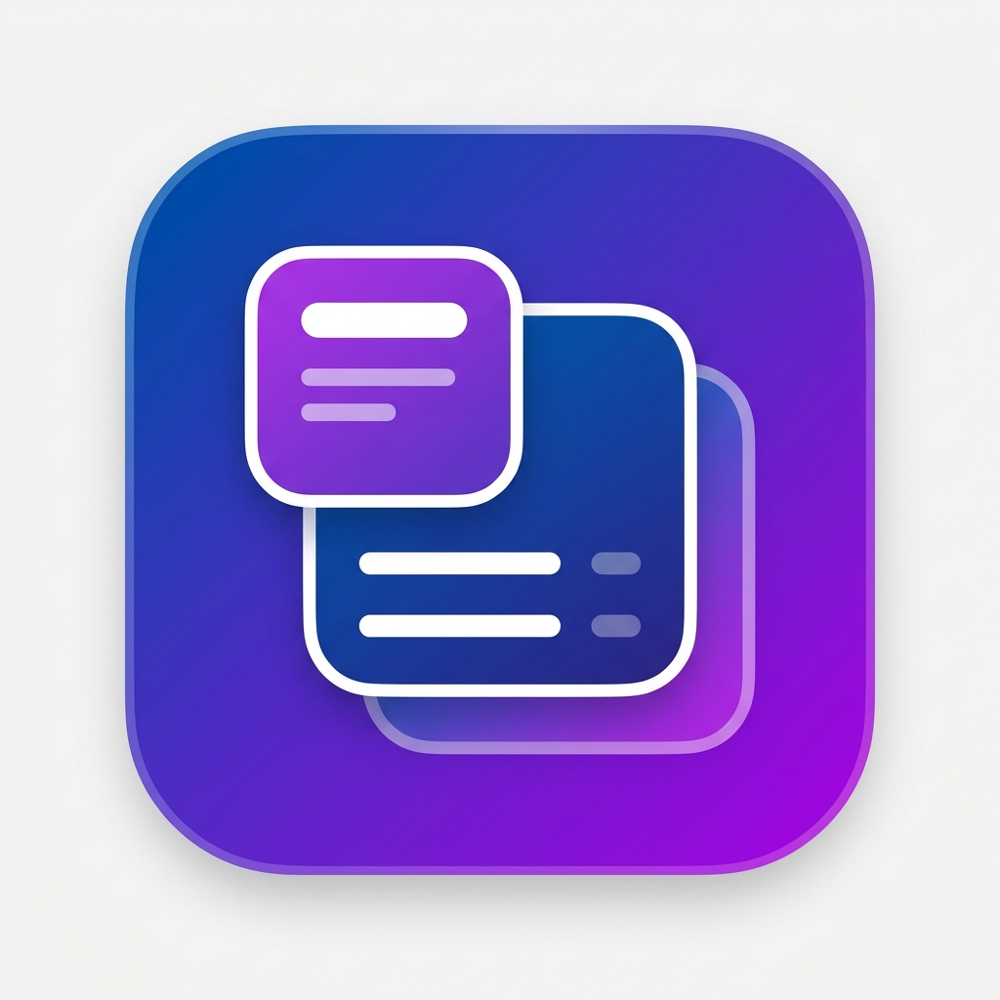

# WidgetCraft

  

## Overview

**WidgetCraft** is a dynamic, premium iOS application that empowers users to customize their home screens with elegantly designed, highly functional widgets. Built on top of Apple's robust WidgetKit and the Widget Stack architecture, the app provides a collection of beautifully crafted widgets that users can mix, match, and stack to suit their daily needs.

## Vision

The primary goal of WidgetCraft is to offer a foundation of high-quality widgets—ranging from productivity trackers and quick-glance calendars to aesthetically pleasing weather and health summaries. Users simply download the app and immediately gain access to a curated gallery of widgets that blend seamlessly with the modern iOS aesthetic.

## Features (Planned)

- **Widget Gallery:** A diverse collection of beautifully designed widgets.
- **Apple Widget Stack Integration:** Fully compatible with iOS smart stacks for intelligent rotation.
- **Customization:** Tweak colors, themes, and data sources for each widget.
- **Premium Tiers:** A foundation of free widgets with an option to unlock advanced, data-rich widgets.

## Development & Interactive Demo

WidgetCraft is open source. You can test and inspect widgets directly using the built-in 24-hour timeline simulator:
- Open `preview/index.html` in any browser to simulate full diurnal cycles, liquid glass transitions, and live vector gauges.

---
*Designed with precision for iOS.*
